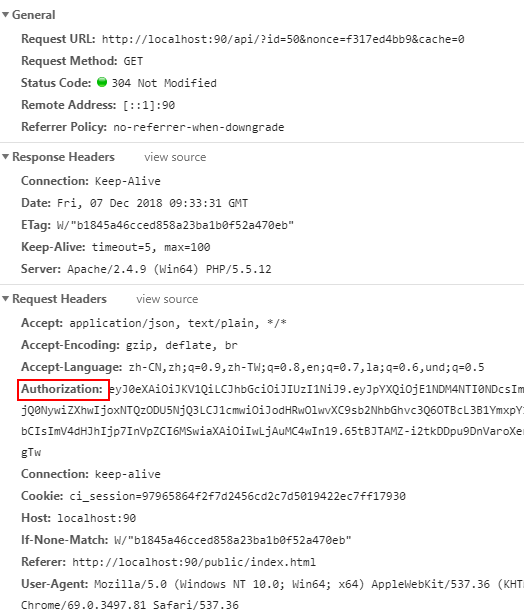

# 数据缓存

::: tip 缓存的作用
在一些应用场景中，比如报表系统。部分报表查询统计耗时较长，但数据变更不频繁，此时可设置一定时长的缓存周期，方便用户加载数据。

后端缓存：当用户 A 加载数据后，B 再加载同样的数据，那么 B 的数据不从数据库读取而是从前台直接返回；

前端缓存：当用户 A 加载数据后，再次刷新页面，系统不再从后端读取数据，同时也不从服务端取信息，直接使用前台缓存结果。
:::

## 常见缓存策略

在大多数的框架中都有对数据做缓存的方案，例如博客系统，将某篇文章的 html 信息按地址做缓存。但对于数据接口而言，接口参数不固定，对其精确缓存较为复杂。为了保证系统的运行效率同时降低数据库压力，我们设计了细粒度的数据缓存方案。

## 后端缓存

在前面的参数列表中，我们设置了用 cache 作为数据缓存时长，假设数据缓存时长为 5 分钟，则以下方式均是支持的

1. localhost/api/50/f317ed4bb9/5
2. localhost/api/50/f317ed4bb9.json?cache=5

设置参数后系统会自动控制缓存。对于开发者而言仅需关注该参数即可，其它将由系统自动处理。

::: tip 手工清除后端缓存
http://localhost:90/api/clear/apiid
:::

## 前端缓存

在 JWT 中所引用的前台请求头如下：

在请求头的 if-non-match 字段中，接口平台将自动维护数据标志，技术细节请[参考这里](https://www.mnot.net/cache_docs/#DEFINITION)。
对于前台缓存未到期的请求，系统返回状态为 304，这在网络状态 general 的 status-code 中可见。
