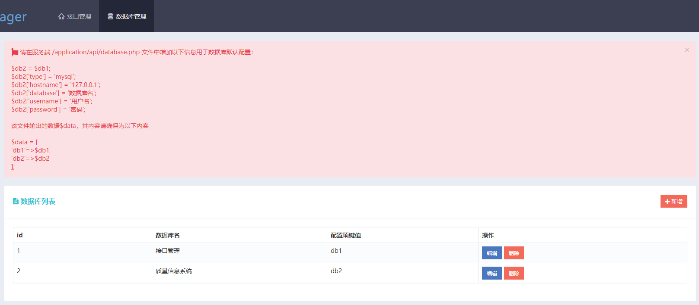

# 数据库配置

## 基础配置

打开应用目录下 _application/api/database.php_,目录结构如下：
::: vue
`thinkPHP`
├─.vscode
├─`application`
│ ├─`api`
│ │ ├─config.php
│ │ ├─`database.php`
│ │ ├─controller
│ │ ├─sql
│ │ └─view
│ │ └─index
│ ├─extra
│ ├─index
│ │ ├─controller
│ │ └─view
│ │ └─index
├─extend
:::

针对不同类型数据库的配置，相关设置参考如下：

```php
/* mysql,默认数据库，用于API管理 */
$db1 = [
    'type' => 'mysql',
    'hostname' => '127.0.0.1',
    'database' => 'api_sheet_manager',
    'username' => 'root',
    'password' => 'root'
];

/* SQL Server */
$db2 = [
    'type' => 'sqlsrv',
    'hostname' => '127.0.0.1',
    'database' => 'Sqlserver_db',
    'username' => 'sa',
    'password' => '123',
    'charset' => 'utf8',
];

/* oracle */
$db3 = [
    'type' => '\think\oracle\Connection',
    'hostname' => '主机IP',
    'database' => 'ORACLE实例名',
    'username' => '用户名',
    'password' => '密码',
    'hostport' => 1521
];

// 将db1设为主数据库，该部分不要修改
$db1['mainDB'] = true;
$db1['db_publicid'] = 1;

// 此处id列表与数据库中对应，可自行配置
$data = [
    'db1' => $db1,
    'db2' => $db2,
    'db3' => $db3,
];

return array(
    "exDatabase" => $data,
);

```

需要注意的是，以下部分作为默认初始化设置，请勿修改：

```php
// 将db1设为主数据库，该部分不要修改
$db1['mainDB'] = true;
$db1['db_publicid'] = 1;
```

在配置多个数据库的时候，建议将键值设置为 db1,db2,db3,... 当然用户也可自定义键值，系统将会自动解析。

```php
// 此处id列表与数据库中对应，可自行配置
$data = [
    'db1' => $db1,
    'db2' => $db2,
    'db3' => $db3,
];
```

## 增加数据库连接

### 1.调整服务端

以上面的默认配置添加一个 oracle 数据库连接为例，将相应代码修改如下：

```php

// $db3 已配置为orcl;
$db4 = $db3;
$db4['hostname'] = '新的主机';
$db4['database'] = '实例名';
$db4['username'] = '用户名';
$db4['password'] = '密码';

// 将db1设为主数据库，该部分不要修改
$db1['mainDB'] = true;
$db1['db_publicid'] = 1;

// 此处id列表与数据库中对应，可自行配置
$data = [
    'db1' => $db1,
    'db2' => $db2,
    'db3' => $db3,
    'db4' => $db4，
];
```

其它数据库可参照修改配置。

::: tip 配置阿里云
阿里云数据库基于 Mysql，将应用部分至 ECS 服务器中，再将相关连接信息按 mysql 的方式填入即可，无需额外配置。
:::

### 2.调整数据库

在前台页面中添加相关数据库设置项,确保键名(keyname)与此处\$data 中的内容保持一致。


