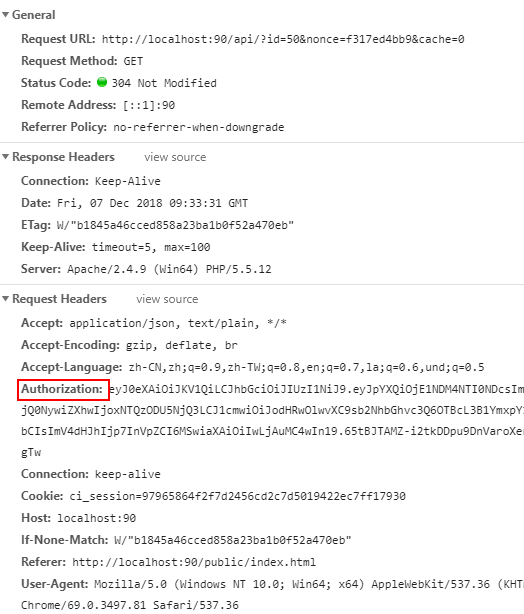

# JWT

::: tip 说明
JWT 主要用于接口鉴权，如果对该部分不了解可自行查询数据
:::

## JWT 配置

打开应用目录下 _application/api/controller/Index.php_,目录结构如下：
::: vue
`thinkPHP`
├─.vscode
├─`application`
│ ├─`api`
│ │ ├─config.php
│ │ ├─database.php
│ │ ├─`controller`
│ │ │ └─`Index.php`
│ │ ├─sql
│ │ └─view
│ ├─extra
│ ├─index
│ │ ├─controller
│ │ └─view
│ │ └─index
├─extend
:::

定位到 ini 函数，内容如下：

```php
    protected function init($request)
    {
        Config::load('config.php');
        $this->request = $request;
        $header = $request->header();
        $header['ip'] = $request->ip();

        Utils::$request = $request;
        Utils::$header = $header;

        $this->setCORS();

        // 测试时取消验证,设为true时支持在地址栏直接输入接口数据调试查看。
        $this->DISABLED_AUTH = true;
    }
```

其中最后一句

> \$this->DISABLED_AUTH = true;

表示是否禁用身份校验，如果设为 false 则表示启用 jwt，此时数据的读写均需要在请求头加入相关身份认证。如果未通过校验，系统拒绝返回数据，同时在浏览器地址栏中直接 get 获取数据的操作也将禁止。

## 前台请求修改

::: danger 安全声明
用户需自行搭建鉴权验证服务，保存登录用户及密码信息，通过请求各自服务器拿到 token，然后返回至前台。此处为方便说明，以前台获取 token 为例说明整个流程。
:::

### 1.获取 token

```js
const host = '//10.8.1.25/api/';
let refreshNoncer = async () => {
  let url = host + 'authorize.json?user=用户名&psw=密码';
  return await http.get(url).then((res) => res.data.token);
};
```

获取到的 token 状态需自行保存。

### 2.请求参数中加入 token

```js
window._global_.token = '';
window._global_.token = await refreshNoncer();

export let axios = async (option) => {

  option = Object.assign(option, {
    headers: {
      Authorization: window._global_.token
    },
    method: option.method || 'get'
  });

  return await http
    .create({
      baseURL: host,
      timeout: 10000,
      transformRequest: [
        function(data) {
          let dataType = getType(data);
          switch (dataType) {
            case 'object':
            case 'array':
              data = qs.stringify(data);
              break;
            default:
              break;
          }
          return data;
        }
      ]
    })(option)
    .then(({ data }) => {
      if (typeof data.token !== 'undefined') {
        window._global_.token = data.token;
        // 建议同时将token存储至localStorage
      }
      return data;
    });
    });
```

这样便在调用中自动加入了 token 信息。需要注意的是，对于 token 的状态用户需自行维护，如可以存储到 localStorage 中。详细请求头如下：



::: tip token 续期

默认 token 存活期为 2 小时，如果超过 2 小时，系统会自动续期，返回数据中将包含 token 这一项。在上例中已经做相关处理
:::
