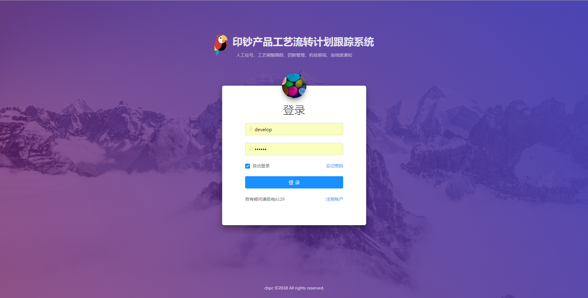

# 系统介绍

数据接口开放平台（以下简称平台）主要解决前后端分离的项目中，后端数据 CRUD 的问题，将常见的数据调用方式(rpc/restful)、数据格式(json/xml)、接口鉴权、反爬虫、前端调用代码、数据缓存、跨域通信等问题一并解决。

---

::: danger 面向开发者
本系统是面向 web 前端、nodejs 后端、小程序开发者，阅读本教程前请确保有 AJAX 数据请求的相关知识。
:::

## 主要功能列表

### 鉴权与反爬

传统接口鉴权以 session/cookies 的方式验证用户身份([查看详情](https://scotch.io/tutorials/the-ins-and-outs-of-token-based-authentication))，当系统需要分布式部署时同时要管理服务端 session 信息。平台以[JWT](http://blog.leapoahead.com/2015/09/06/understanding-jwt/)为基础设计接口鉴权方案。依靠丰富的爬虫经验设计反爬虫规则，轻松适应不同应用场景。

### RPC/Restful

同时支持 RPC 与 Restful 两种调用模式，根据需要灵活选择。

### JSON/XML 支持

在满足现代前端开发的 json 规范基础上，增加 XML 格式的输出，满足老项目对数据格式的要求。

### 自动代码生成

根据多年前端开发经验，自动生成适用于满足微信小程序、web、NodeJS 的前台调用代码，调用函数名自动生成，自动添加注释，代码风格统一规范。

### 多数据源支持

支持 SQL Server、MySQL、Oracle 三大关系型数据库，统一调用规则，前后端分离开发中不再关注后端，只需关注前台业务逻辑。

### 高速缓存

根据不同场景自动设置前后台数据缓存方案，后端指定缓存时长或前端 304 皆可，灵活满足不同开发场景，保障接口响应时间。

### blob 图像格式支持

根据行业数据存储特点，增加对 blob 图像数据的支持，方便一次读取大批量图片。

### 支持微信网页与微信小程序开发

该模块基于微信接口鉴权关键 API 设计，满足微信小程序和微信网页开发，相对于市面的开源微信开发框架更加轻便，经受住了数千万人次的大型微信活动考验。

### 通用化设计

该系统已在公司多个 web 系统中应用，后端数据调用与业务完全解耦，满足各类数据报表、图表、数据表单 CRUD 操作等场景，数据输出格式统一，减少前后端联调成本。

## Todo

本系统仍然处于开发中，这里有一些目前还不支持、但已经在计划中的特性：

- WebSocket 协议接口动态支持
- 数据缓存同时支持文件缓存与 Redis 缓存
- 数据 Mock

我们欢迎你为系统功能提出建议。

## 系统主页

点击这里 [http://10.8.1.25:100](http://10.8.1.25:100) 进入系统主页，首次进入系统将要求登录。

