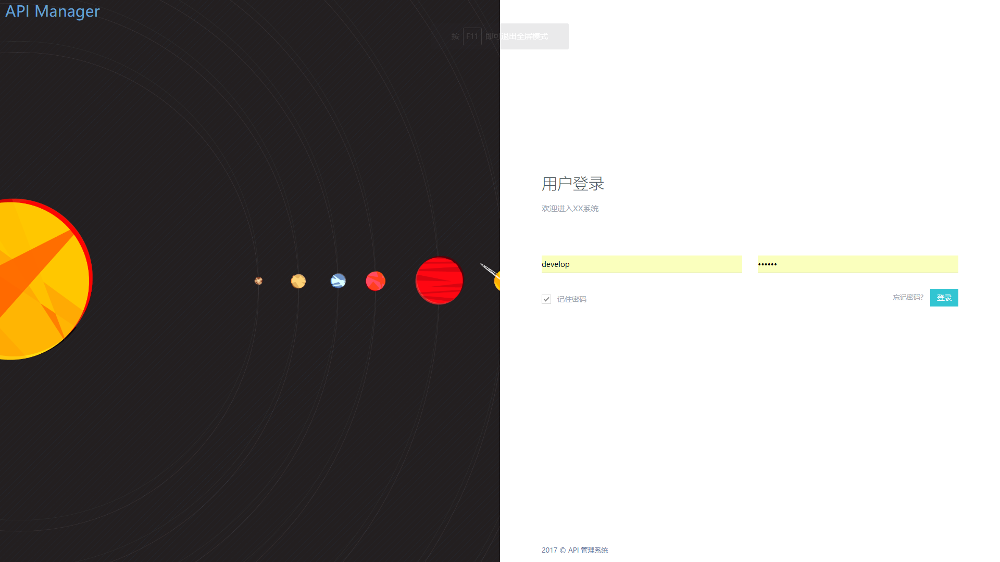

# 系统介绍

::: tip 背景
本系统主要解决前后端分离的项目中，后端数据 CRUD 的问题，将常见的数据调用方式(rpc/restful)、数据格式(json/xml)、接口鉴权、前面调用代码、数据缓存等问题一并解决。

:::

## 主要功能列表

### 人工拉号自动排活

根据上周生产情况以及图像判废工序分发的异常品，自动对码后核查“25 万抽检 1 万”的规定自动分配抽检车号，确保所有印刷机台全覆盖。

### 异常品处理

1. 图像核查异常品

图像判废中的异常品处理流程，其中人工拉号的产品将自动分配到下周第一个工作日的[人工拉号排活](/guide/#人工拉号自动排活)任务列表中。

2. 批量锁车/解锁/工艺调整

用户提供一组需要锁车、解锁或同时调整工艺的产品列表，系统自动根据需要调整相应流程。

3. 在库产品锁车列表(2018 年 08 月 13 日新增)

   提供库房待出库产品中，当前处理锁定状态的车号列表以及对应锁车原因，锁车人等信息。

### 批量产品计划

提供四新产品的计划任务调度功能。

### 机检弱项通知

1. 机台连续废通知

机台生产过程中的连续废或机检弱项产品的开位/千位通知，方便后工序处理。

2. 机检弱项记废

对废品分析出的弱项产品记废、汇总、统计等功能。

## Todo

本系统仍然处于开发中，这里有一些目前还不支持、但已经在计划中的特性：

- 四新进度实际推送
- **锁车超时推送提醒**
- 图像判废自动判活，由原客户端移植至网页

我们欢迎你为系统功能提出建议。

## 系统主页

点击这里 [http://10.8.2.133:92](http://10.8.2.133:92) 进入系统主页，首次进入系统将要求登录，用户名密码与质量数据平台一致。

