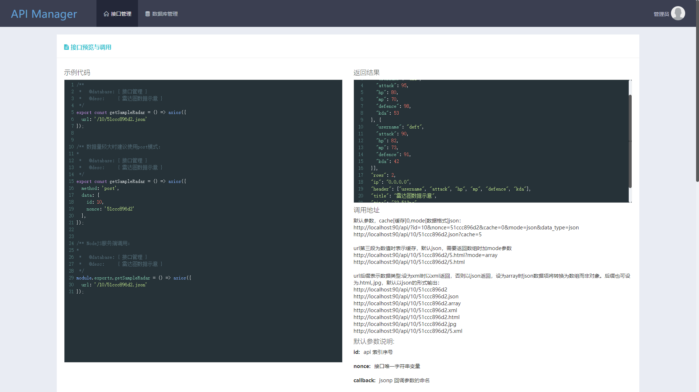
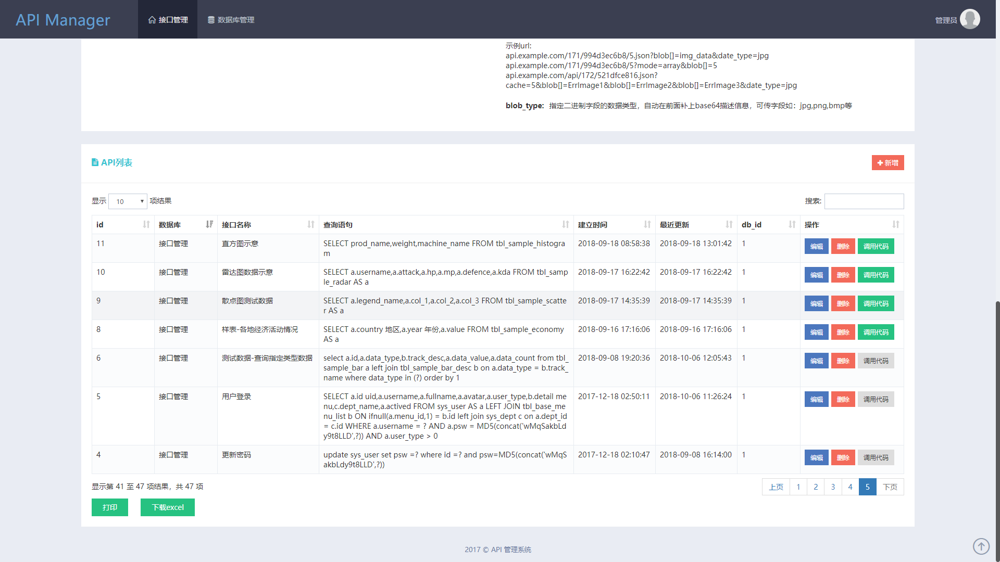

# 操作界面

## 菜单

进入系统后你将看到如下界面：

顶部是接口管理与数据库管理菜单，其中数据库管理仅显示当前数据库列表，基于响应时间的考虑，此处不作为配置信息被后台调用。

## 主界面

在主界面左侧是接口预览与调用界面，右侧是数据预览界面。

## API 管理

在主界面下方则是 API 管理的部分，这里显示了接口列表，对接口的新增、编辑、删除、过滤搜索、模拟调用等操作均在此处进行。

点击 API 列表右侧上方的【新增】按钮，打开新增 API 的界面，对它的具体使用在以后描述:

