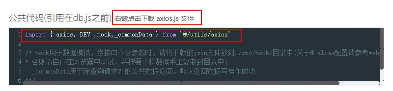

# 数据 MOCK（new）

> 2019 年 2 月 22 日增加

在加入数据 mock 功能后，让离线开发成为了可能。

## 使用场景

在线上开发时，由于可以直连数据库或在本地搭建测试环境，数据请求通过接口管理直接与数据库通信。但如果需要在无网络环境时多人开发，这时便需要引入数据 mock 功能。

在本部分，我们并未使用配置上更复杂的 [mock.js](http://mockjs.com)，而是根据**约定大于配置**的原则做了以下约定：

1. mock 数据文件存放于 ./src/mock 目录下
2. 被 mock 的文件名由原来的路径 id/nonce 调整为 id_nonce.json
3. 文件的相对应用使用@符号，这可以在 webpack 文件中做以下配置([详情可参考这里](https://webpack.js.org/configuration/resolve/#resolve-alias))。当然，在 vue-cli,umi.js 等封装中已经自动配置好了这些设置，你可以直接使用，待报错时再来排查：
   ```js
    resolve:{
      alias: {
        '@': resolve('src')
      }
    }
   ```

## 使用 mock

### 无参数可直接调用的接口

1. 更新 axios.js,db.js
   根据接口管理页面的提示，下载 axios 文件，同时将公共函数/定义引入 db.js 中



2. 新建目录

   在 src/目录中建立 mock 目录，此时你的开发目录可能是这样的
   ::: vue
   ├─assets
   ├─components
   ├─layouts
   ├─locales
   ├─`mock`_(**目录**)_
   ├─models
   ├─pages
   │ ├─chart
   │ │ ├─components
   │ │ ├─models
   │ │ ├─services
   │ │ └─utils
   │ │ └─charts
   │ ├─login
   │ ├─menu
   │ └─table
   ├─services
   └─utils
   :::

3.调用接口

调用一个接口，系统会生成下面这样的一段测试代码，将其复制到 db.js 中，同时将下载下来的 json 文件置入刚才的 mock 目录中，此时 db 文件可能会是这样

```js
import { axios, DEV, mock, _commonData } from '@/utils/axios';

/**
*   @database: { MES_MAIN }
*   @desc:     { MES_图像判废每日待判车号列表 } 
    const { tstart, tend } = params;
*/
export const getVCbpcCartlist = (params) =>
  DEV
    ? mock(require('@/mock/355_aa81563201.json'))
    : axios({
        url: '/355/aa81563201.json',
        params
      });
```

### 有参数的接口

对于有参数的接口，你可以手动拼接 url 地址，在浏览器中打开该接口，将内容复制存为对应的 json 文件，后续操作同无参数的接口保持一致。

## mock 函数的设计

### mock 函数

在我们所提供的 axios.js 文件中，加入了这样的 mock 函数

```js
// 导出数据，随机时长
export type MockFn = <T>(T, time: number) => Promise<T>;

export const mock: MockFn = (path, time = Math.random() * 2000) =>
  new Promise((resolve) => {
    setTimeout(() => {
      resolve(path);
    }, time);
  });
```

该函数支持两种模式，当直接传入路径时将调用 require('文件路径')直接读取数据，当传入数据时(手工模拟的数据)返回该数据本身。

使用 setTimeout 是为了模拟 0 至 2 秒的随机时间，这在需要展示数据加载动画的应用场景中很有必要。

### 数据写操作

由于接口管理系统除了支持查询外，还支持 增、删、改等操作，对于这些接口不便提供模拟数据以拿到结果。由于在对数据写的场景中返回格式相同，我们定义了以下的公共数据以适应所有的写操作，该数据结构与实际接口返回一致，同时使用了随机整数返回 id 值(这主要是用在插入数据后返回主 id);

```js
export const _commonData = {
  rows: 1,
  data: [{ affected_rows: 1, id: Math.ceil(Math.random() * 100) }],
  time: 20,
  ip: '127.0.0.1',
  title: '数据更新/插入/删除返回值'
};
```

对数据写操作的接口调用，我们调整为了以下的方式，使用公共的数据定义后，对写操作便不再需要复制 json 文件：

```js
// 为便于理解，此处将相关数据引用也加入
import { axios, DEV, mock, _commonData } from '@/utils/axios';

export const addSysUser = (params) =>
  DEV
    ? mock(_commonData)
    : axios({
        url: '/29/607526f43d.json',
        params
      });
```
