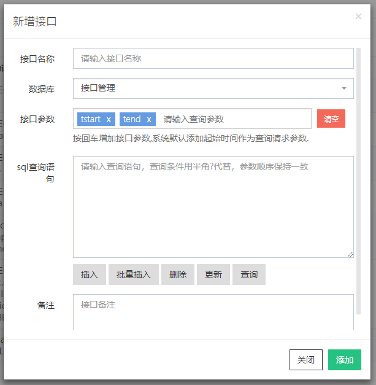
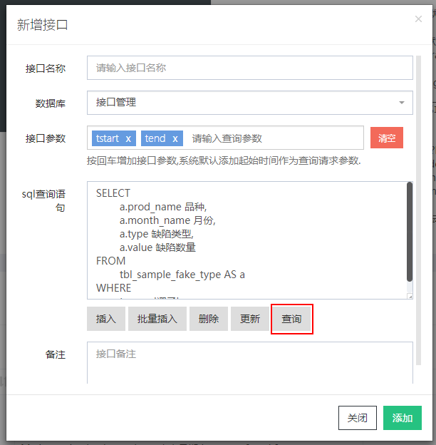
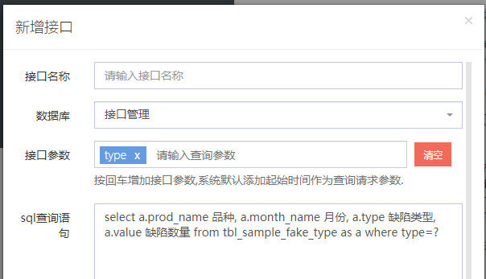
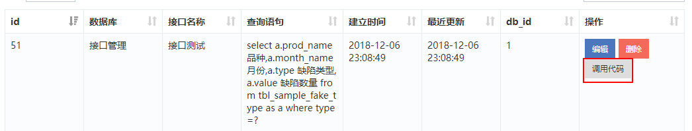
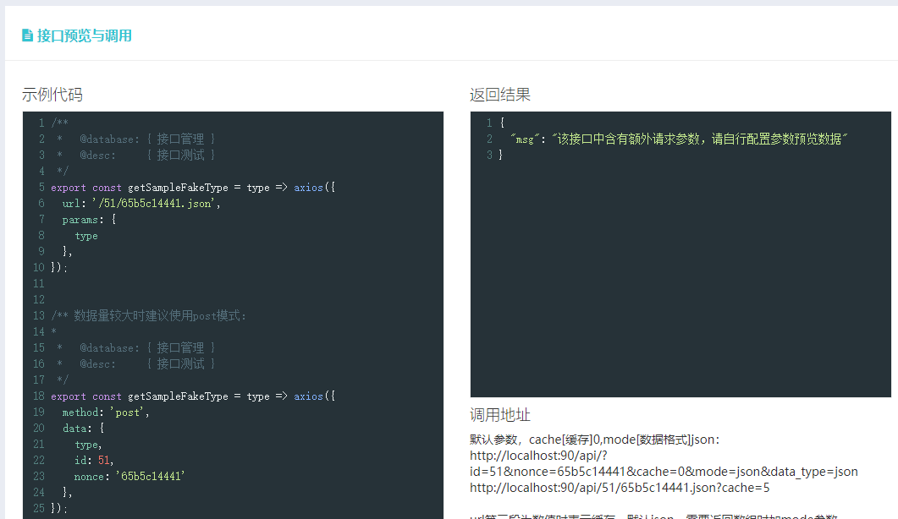

# 接口管理

## 增加接口

点击 API 列表右侧上方的【新增】按钮，打开新增 API 的界面:


```sql
SELECT
	a.prod_name 品种,
	a.month_name 月份,
	a.type 缺陷类型,
	a.value 缺陷数量
FROM
	tbl_sample_fake_type AS a
WHERE
	type = '褶子'
```

将其粘贴到 SQL 查询语句 输入框中，然后点击 【查询】按钮：


此时查询参数中 type = '褶子' 将 type 自动视为查询参数，并将后续的字段替换为 type:



输入接口名称及选择好数据库后点击添加，一个接口便添加完成：



## 调用接口

ctrl+f5 刷新页面，找到最新添加的这个接口，点击右侧调用代码，页面自动滚动到顶部并出现如下的说明：



### 1. get 请求

为了方便说明，后续我们不再截图，直接查看系统给出的示例代码如下：

```js
/**
 *   @database: { 接口管理 }
 *   @desc:     { 接口测试 }
 */
export const getSampleFakeType = (type) =>
  axios({
    url: '/51/65b5c14441.json',
    params: {
      type
    }
  });
```

此处以 axios 调用为例，展示了前台 get 方法调用接口的示例代码，此处已将数据库中的表单 _tbl_sample_fake_type_ 自动转为 _getSampleFakeType。_

::: tip
get 调用代码由系统默认复制到剪贴板中，点击按钮后可直接粘贴到前台。在默认的 get 方式调用中，适用于请求的参数不大的情况，如果需要一次性发送较大量的数据，建议使用 POST 模式。另外，默认的 get 方式除了适用于 web 开发外，微信小程序也同样适用。
:::

### 2. post 请求

系统自动生成的 post 请求数据代码如下，适用于前台提交大量表单的场景：

```js
/** 数据量较大时建议使用post模式：
 *
 *   @database: { 接口管理 }
 *   @desc:     { 接口测试 }
 */
export const getSampleFakeType = (type) =>
  axios({
    method: 'post',
    data: {
      type,
      id: 51,
      nonce: '65b5c14441'
    }
  });
```

### 3. Node.js 调用

由于 node 不支持直接*export*，所以单独将 node 端的调用方式分离如下：

```js
/** NodeJS服务端调用：
 *
 *   @database: { 接口管理 }
 *   @desc:     { 接口测试 }
 */
module.exports.getSampleFakeType = (type) =>
  axios({
    url: '/51/65b5c14441.json',
    params: {
      type
    }
  });
```

### 4. 调用系统生成的代码

假设对应代码片断存为 _db.js_，对接口逻辑的调用示例如下：

```js
// 业务逻辑
import * as db from './db.js'
async fetchData(){
  let res = await db.getSampleFakeType('折子');
  ...
}
```

## 接口输出字段说明

前后端分离的架构中，前台和后台的数据格式往往存在一定差异，为了将这种差异通过一种较通用的方式约定以满足更广泛的需要，我们设计了这样的数据结构方案。

### 接口字段

这里我们以一个示例接口[http://localhost:90/api/50/f317ed4bb9/5.json](http://localhost:90/api/50/f317ed4bb9/5.json)为例说明接口的参数构成。

```json
{
  "data": [
    {
      "工序": "胶印",
      "作废类型": "粘纸",
      "作废数": "0",
      "品种": "A"
    },
    {
      "工序": "胶印",
      "作废类型": "粘纸",
      "作废数": "0",
      "品种": "B"
    }
  ],
  "rows": 205,
  "ip": "0.0.0.0",
  "header": ["工序", "作废类型", "作废数", "品种"],
  "title": "作废类型分布",
  "time": "11.316ms",
  "source": "数据来源：接口管理"
}
```

系统默认输出 json 格式的数据，如果我们希望输出 xml 格式，只需要将后缀 json 改为 xml 即可[http://localhost:90/api/50/f317ed4bb9/5.xml](http://localhost:90/api/50/f317ed4bb9/5.xml):

```xml
<think>
  <data>
    <item id="0">
      <工序>胶印</工序>
      <作废类型>粘纸</作废类型>
      <作废数>0</作废数>
      <品种>A</品种>
    </item>
    <item id="1">
      <工序>胶印</工序>
      <作废类型>粘纸</作废类型>
      <作废数>0</作废数>
      <品种>B</品种>
    </item>
  </data>
  <rows>205</rows>
  <ip>0.0.0.0</ip>
  <header>
    <item id="0">工序</item>
    <item id="1">作废类型</item>
    <item id="2">作废数</item>
    <item id="3">品种</item>
  </header>
  <title>作废类型分布</title>
  <time>15.618ms</time>
  <cache>
    <length>300</length>
    <time>2018-12-06 23:42:48</time>
  </cache>
  <source>数据来源：接口管理</source>
</think>
```

此处我们仅对 JSON 接口的输出说明如下：

```ts
type TItem = {
  [key: string | number]: string | number | void;
};

interface ApiSchema {
  data: Array<TItem>;
  rows: number;
  ip: string;
  header: Array<string>;
  title: string;
  time: string;
  source: string;
}
```

- data：表示接口的数据体
- rows：表示数据行数，如果无数据返回则 rows 为 0
- ip：表示请求端 ip
- header：对应数据库中的字段
- title：对应接口创建时的名称，同时作为注释信息显示在调用代码中
- time：表示接口响应时间，用于调试
- source：表示接口读取自哪个数据库；

### rows

::: tip
常见的接口设计中，会加入 status 字段表示状态，如 200 表示成功，401 表示认证失败。在本次接口设计中，我们通过返回端的 status 直接显示返回状态，这也与 http 的设计理念一致。
:::

另外，我们加入了 rows，其值等于 data.length，方便显示是否有数据返回，体会以下的代码：

```js
async function sample() {
  let res = await db.getSampleData();
  if (!res.rows) {
    console.log('无数据');
  }
}

async function sample2() {
  let res = await db.getSampleData();
  if (!res.data.length) {
    console.log('无数据');
  }
}
```

### header

在报表系统的场景中，常常需要指定表头，考虑到表头与数据库的字段列一致，我们可以直接将 header 放在一个数组中返回，甚至在数据体的 data 结构中，以数组的方式返回数据，这样数据的传输过程中连 key 都不需要：

```json
{
  "data": [
    [7, "score", "得分", "0", 16315],
    [8, "score", "得分", "10", 85132],
    [9, "score", "得分", "20", 235152],
    [10, "score", "得分", "30", 468738],
    [11, "score", "得分", "40", 626334],
    [12, "score", "得分", "50", 755303],
    [13, "score", "得分", "60", 863374]
  ],
  "rows": 11,
  "ip": "0.0.0.0",
  "header": ["id", "data_type", "track_desc", "data_value", "data_count"],
  "title": "测试数据-查询指定类型数据",
  "time": "14.547ms",
  "source": "数据来源：接口管理"
}
```

到这里为止，我们清楚了如何创建接口、预览接口、前台调用接口以及接口返回的参数说明，接下来将对系统中前后端的约定做详细说明。
